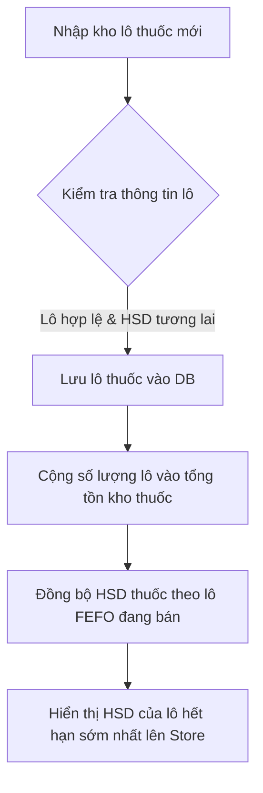
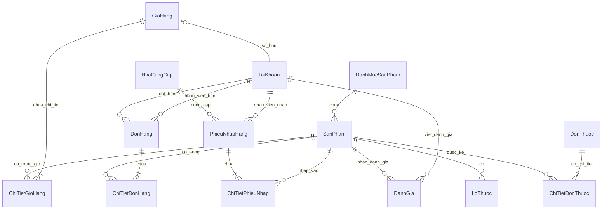
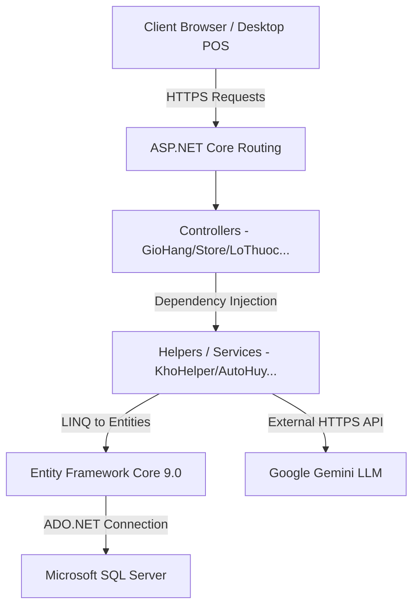

# TRƯỜNG ĐẠI HỌC CÔNG NGHỆ THÔNG TIN
# KHOA KỸ THUẬT PHẦN MỀM
***
<br><br><br><br>

<p align="center">
  <font size="6"><b>BÁO CÁO ĐỒ ÁN TỐT NGHIỆP</b></font><br><br>
  <font size="5"><b>ĐỀ TÀI: XÂY DỰNG HỆ THỐNG BÁN LẺ VÀ QUẢN LÝ DƯỢC PHẨM ĐA KÊNH TÍCH HỢP TRÍ TUỆ NHÂN TẠO (AI) & QUẢN LÝ KHO THEO PHƯƠNG PHÁP FEFO</b></font>
</p>

<br><br><br><br><br><br>

<table align="center">
  <tr>
    <td width="250px"><font size="4"><b>Giảng viên hướng dẫn:</b></font></td>
    <td><font size="4">TS. Nguyễn Văn A</font></td>
  </tr>
  <tr>
    <td><font size="4"><b>Sinh viên thực hiện:</b></font></td>
    <td><font size="4">Nguyễn Văn B (MSSV: 12345678)</font></td>
  </tr>
  <tr>
    <td><font size="4"><b>Lớp:</b></font></td>
    <td><font size="4">Kỹ thuật Phần mềm - Khóa 2022</font></td>
  </tr>
</table>

<br><br><br><br><br>
<p align="center">
  <font size="4"><b>THÀNH PHỐ HỒ CHÍ MINH, NĂM 2026</b></font>
</p>

---
<!-- slide -->
# LỜI CẢM ƠN

Trước tiên, em xin gửi lời cảm ơn chân thành sâu sắc nhất đến các Thầy Cô Khoa Kỹ thuật Phần mềm đã truyền đạt những kiến thức vô cùng quý báu trong suốt những năm học vừa qua tại nhà trường. Những kiến thức lý thuyết vững vàng cùng các bài tập thực hành thực tế chính là bệ phóng quan trọng giúp em hoàn thành tốt đồ án tốt nghiệp này.

Đặc biệt, em xin gửi lời cảm ơn sâu sắc nhất tới thầy hướng dẫn **TS. Nguyễn Văn A**, người đã tận tình chỉ bảo, định hướng đề tài và đưa ra những đóng góp chuyên môn quý báu trong suốt quá trình phân tích, thiết kế và triển khai ứng dụng.

Mặc dù đã cố gắng nỗ lực hết mình để hoàn thiện hệ thống một cách tối ưu nhất, tuy nhiên đồ án chắc chắn không tránh khỏi những thiếu sót ngoài ý muốn. Kính mong nhận được ý kiến đóng góp, phê bình từ quý Thầy Cô trong Hội đồng bảo vệ để đồ án này ngày càng hoàn thiện và mang tính thực tiễn cao hơn.

*Sinh viên thực hiện*
**Nguyễn Văn B**

---
<!-- slide -->
# LỜI CAM ĐOAN

Em xin cam đoan đồ án tốt nghiệp với đề tài **"Xây dựng hệ thống bán lẻ và quản lý dược phẩm đa kênh tích hợp Trí tuệ nhân tạo (AI) & Quản lý kho theo phương pháp FEFO"** là công trình nghiên cứu do chính bản thân em tự thực hiện dưới sự định hướng và hướng dẫn trực tiếp từ Thầy hướng dẫn TS. Nguyễn Văn A.

Các số liệu, mã nguồn (codebase), sơ đồ phân tích và kết quả thực nghiệm được trình bày trong báo cáo này hoàn toàn trung thực, khách quan và dựa trên mã nguồn thực tế của hệ thống. Mã nguồn dự án được xây dựng dựa trên kiến thức tích lũy của bản thân và không sao chép trái phép từ bất kỳ nghiên cứu hay đồ án của tác giả khác.

Nếu có bất kỳ sự gian lận nào, em xin chịu hoàn toàn trách nhiệm trước Hội đồng và Nhà trường.

*Sinh viên cam đoan*
**Nguyễn Văn B**

---
<!-- slide -->
# MỤC LỤC

- [BÁO CÁO ĐỒ ÁN TỐT NGHIỆP](#báo-cáo-đồ-án-tốt-nghiệp)
- [LỜI CẢM ƠN](#lời-cảm-ơn)
- [LỜI CAM ĐOAN](#lời-cam-đoan)
- [CHƯƠNG 1: TỔNG QUAN VỀ ĐỀ TÀI](#chương-1-tổng-quan-về-đề-tài)
  - [1.1. Đặt vấn đề & Lý do chọn đề tài](#11-đặt-vấn-đề--lý-do-chọn-đề-tài)
  - [1.2. Mục tiêu nghiên cứu và xây dựng hệ thống](#12-mục-tiêu-nghiên-cứu-và-xây-dựng-hệ-thống)
  - [1.3. Đối tượng và Phạm vi nghiên cứu](#13-đối-tượng-và-phạm-vi-nghiên-cứu)
- [CHƯƠNG 2: PHÂN TÍCH VÀ THIẾT KẾ HỆ THỐNG](#chương-2-phân-tích-và-thiết-kế-hệ-thống)
  - [2.1. Phân tích các quy trình nghiệp vụ cốt lõi](#21-phân-tích-các-quy-trình-nghiệp-vụ-cốt-lõi)
  - [2.2. Phân tích yêu cầu hệ thống (System Requirements)](#22-phân-tích-yêu-cầu-hệ-thống-system-requirements)
  - [2.3. Thiết kế Cơ sở dữ liệu (Database Schema Design)](#23-thiết-kế-cơ-sở-dữ-liệu-database-schema-design)
  - [2.4. Sơ đồ các mối quan hệ thực thể (ERD) và ràng buộc](#24-sơ-đồ-các-mối-quan-hệ-thực-thể-erd-và-ràng-buộc)
- [CHƯƠNG 3: THIẾT KẾ KỸ THUẬT VÀ GIẢI PHÁP CÔNG NGHỆ](#chương-3-thiết-kế-kỹ-thuật-và-giải-pháp-công-nghệ)
  - [3.1. Kiến trúc tổng quan hệ thống](#31-kiến-trúc-tổng-quan-hệ-thống)
  - [3.2. Thuật toán quản lý kho dược phẩm tối ưu FEFO (First-Expired, First-Out)](#32-thuật-tán-quản-lý-kho-dược-phẩm-tối-ưu-fefo-first-expired-first-out)
  - [3.3. Cơ chế tự động hóa: Background Service DonHangAutoHuyService](#33-cơ-chế-tự-động-hóa-background-service-donhangautohuyservice)
  - [3.4. Đảm bảo toàn vẹn dữ liệu trong giao dịch (Database Transaction ACID)](#34-đảm-bảo-toàn-vẹn-dữ-liệu-trong-giao-dịch-database-transaction-acid)
  - [3.5. Cơ chế xác thực (Authentication), phân quyền (Authorization) và kiểm soát IDOR](#35-cơ-chế-xác-thực-authentication-phân-quyền-authorization-và-kiểm-soát-idor)
  - [3.6. Tích hợp mô hình ngôn ngữ lớn (LLM - Google Gemini API) hỗ trợ tư vấn biệt dược](#36-tích-hợp-mô hình-ngôn-ngữ-lớn-llm---google-gemini-api-hỗ-trợ-tư-vấn-biệt-dược)
- [CHƯƠNG 4: TRIỂN KHAI VÀ KẾT QUẢ ĐẠT ĐƯỢC](#chương-4-triển-khai-và-kết-quả-đạt-được)
  - [4.1. Môi trường triển khai và cấu hình dự án](#41-môi-trường-triển-khai-và-cấu-hình-dự-án)
  - [4.2. Kết quả giao diện & chức năng phía Khách hàng (Store Front)](#42-kết-quả-giao-diện--chức-năng-phía-khách-hàng-store-front)
  - [4.3. Kết quả giao diện & chức năng phía Quản trị (Admin) và Nhân viên (POS)](#43-kết-quả-giao-diện--chức-năng-phía-quản-trị-admin-và-nhân-viên-pos)
  - [4.4. Kiểm thử hệ thống và Đánh giá chất lượng (System Testing & Quality Evaluation)](#44-kiểm-thử-hệ-thống-và-đánh-giá-chất-lượng-system-testing--quality-evaluation)
- [CHƯƠNG 5: ĐÁNH GIÁ VÀ HƯỚNG PHÁT TRIỂN](#chương-5-đánh-giá-và-hướng-phát-triển)
  - [5.1. Ưu điểm nổi bật của hệ thống](#51-ưu-điểm-nổi-bật-của-hệ-thống)
  - [5.2. Nhược điểm và hạn chế tồn tại](#52-nhược-điểm-và-hạn-chế-tồn-tại)
  - [5.3. Hướng phát triển và mở rộng trong tương lai](#53-hướng-phát-triển-và-mở-rộng-trong-tương-lai)
  - [5.4. Đánh giá năng lực và Kỹ năng chuyên môn đạt được (Professional Skills & Competencies Evaluation)](#54-đánh-giá-năng-lực-và-kỹ-năng-chuyên-môn-đạt-được-professional-skills--competencies-evaluation)
- [TÀI LIỆU THAM KHẢO](#tài-liệu-tham-khảo)

---
<!-- slide -->
# CHƯƠNG 1: TỔNG QUAN VỀ ĐỀ TÀI

## 1.1. Đặt vấn đề & Lý do chọn đề tài

Ngành dược phẩm và chăm sóc sức khỏe đóng vai trò then chốt trong đời sống xã hội. Những năm gần đây, dưới sự tác động mạnh mẽ của cuộc cách mạng công nghiệp 4.0 và chuyển đổi số y tế, thói quen tiêu dùng của người dân đối với các mặt hàng dược phẩm và thực phẩm chức năng đã có những dịch chuyển đáng kể từ offline sang online. Việc đặt mua thuốc trực tuyến giúp người tiêu dùng tiết kiệm thời gian, dễ dàng so sánh giá cả và tiếp cận được các dịch vụ tư vấn y tế thuận tiện.

Tuy nhiên, kinh doanh dược phẩm là một ngành nghề đặc thù và chịu sự quản lý nghiêm ngặt về chất lượng, nguồn gốc và đặc biệt là **hạn sử dụng (Expiry Date)**. Việc quản lý kho bãi tại các nhà thuốc truyền thống và các hệ thống e-commerce hiện nay thường gặp phải các thách thức lớn sau:
1. **Rủi ro thất thoát do thuốc hết hạn:** Thuốc là sản phẩm có hạn dùng cố định. Nếu không có cơ chế luân chuyển kho hợp lý, các lô thuốc cũ có hạn dùng gần hơn rất dễ bị tồn đọng và phải tiêu hủy, gây thiệt hại nghiêm trọng về mặt kinh tế.
2. **Quản lý kho theo phương pháp FEFO thiếu tự động hóa:** Nguyên tắc **FEFO (First-Expired, First-Out - Hết hạn trước, Xuất trước)** là tiêu chuẩn bắt buộc trong quản lý dược phẩm của Bộ Y Tế. Tuy nhiên, nhiều hệ thống hiện nay chỉ quản lý tồn kho theo tổng số lượng (Total Quantity) hoặc xuất kho theo FIFO (First-In, First-Out), dẫn đến tình trạng xuất các lô thuốc mới nhập trong khi lô cũ sắp hết hạn vẫn nằm trên kệ.
3. **Thách thức tư vấn biệt dược trực tuyến:** Người bệnh khi mua thuốc trực tuyến thường thiếu sự chỉ dẫn trực tiếp của dược sĩ. Việc tự ý mua và sử dụng thuốc kê đơn hoặc không hiểu rõ tác dụng phụ, tương tác thuốc cực kỳ nguy hiểm. Các chatbot thông thường chỉ phản hồi theo kịch bản cứng nhắc, không thể tư vấn linh hoạt theo ngữ cảnh thực tế của từng sản phẩm.
4. **Sự tách biệt giữa kênh bán hàng Online và tại quầy (POS):** Việc quản lý bất đồng bộ dữ liệu giữa việc khách hàng mua trực tiếp tại quầy và mua online dẫn đến sai lệch lớn về số liệu tồn kho thực tế, gây khó khăn cho việc quản lý các lô thuốc.

Xuất phát từ những thực tiễn và thách thức trên, đề tài **"Xây dựng hệ thống bán lẻ và quản lý dược phẩm đa kênh tích hợp Trí tuệ nhân tạo (AI) & Quản lý kho theo phương pháp FEFO"** đã được nghiên cứu và phát triển nhằm mang lại giải pháp công nghệ toàn diện giải quyết triệt để các bài toán nghiệp vụ của một nhà thuốc thông minh thời đại số.

---

## 1.2. Mục tiêu nghiên cứu và xây dựng hệ thống

Đồ án hướng tới việc thiết kế và xây dựng một hệ thống phần mềm hoàn chỉnh, đáp ứng các mục tiêu sau:
*   **Hệ thống bán hàng đa kênh đồng bộ (Omnichannel):** Hỗ trợ khách hàng đặt mua online trên Web Store tiện lợi, đồng thời cung cấp giao diện POS bán hàng chuyên nghiệp tại quầy cho dược sĩ. Tất cả dữ liệu giao dịch, giỏ hàng, thông tin tài khoản đều được đồng bộ hóa tức thời trên một cơ sở dữ liệu tập trung.
*   **Thuật toán FEFO tự động hóa ở mức mã nguồn:** Triển khai cơ chế tự động trừ kho từ lô thuốc có hạn sử dụng gần nhất trước, tự động hoàn kho vào lô có hạn sử dụng xa nhất khi đơn hàng bị hủy. Đồng thời tự động cập nhật hiển thị hạn sử dụng của lô đang bán lên kệ cửa hàng.
*   **Dịch vụ chạy ngầm tự động hóa quy trình (Background Services):** Tự động quét và xử lý hủy các đơn hàng trực tuyến quá hạn thanh toán để giải phóng tồn kho của các lô thuốc, tránh giam giữ hàng gây ảnh hưởng tới hoạt động kinh doanh trực tiếp tại quầy.
*   **Tích hợp Trí tuệ Nhân tạo hỗ trợ tư vấn:** Ứng dụng mô hình ngôn ngữ lớn (LLM) thông qua API của Google Gemini để cung cấp trợ lý tư vấn y tế thông minh, có khả năng phân tích thông tin biệt dược từ cơ sở dữ liệu thực tế của cửa hàng để đưa ra lời khuyên sử dụng thuốc chính xác và an toàn.
*   **Bảo mật và toàn vẹn giao dịch cao:** Đảm bảo an toàn tuyệt đối cho quy trình đặt hàng và thanh toán bằng cách áp dụng Database Transaction (giao dịch ACID) để ngăn ngừa lỗi bất đồng bộ đồng thời (Concurrency), kiểm soát chặt chẽ lỗ hổng IDOR và CSRF.

---

## 1.3. Đối tượng và Phạm vi nghiên cứu

*   **Đối tượng nghiên cứu:**
    *   Các mô hình và kiến trúc phát triển web hiện đại: ASP.NET Core MVC 10.0, Entity Framework Core 9.0.
    *   Thuật toán quản lý kho dược phẩm GSP/GPP, phương pháp luân chuyển kho FEFO (First-Expired, First-Out).
    *   Quy trình nghiệp vụ quản lý đơn thuốc điện tử (Prescriptions) và bán hàng trực tiếp tại quầy (Point of Sale - POS).
    *   Kỹ thuật tích hợp và tối ưu hóa Prompt Engineering cho các mô hình AI tạo sinh (Google Gemini AI).
    *   Các cơ chế xử lý đồng thời (Concurrency Controls), Transaction cô lập dữ liệu và kiểm soát an toàn bảo mật hệ thống web.
*   **Phạm vi nghiên cứu:**
    *   Xây dựng ứng dụng Web đa kênh chạy trên nền tảng .NET 10.0, sử dụng cơ sở dữ liệu Microsoft SQL Server.
    *   Hệ thống phân quyền chi tiết cho 4 nhóm đối tượng người dùng: Khách hàng (KhachHang), Nhân viên bán thuốc (NhanVien), Bác sĩ kê đơn (BacSi) và Quản trị viên (Admin).
    *   Hệ thống quản lý và xử lý giao dịch tự động không tích hợp các cổng thanh toán thực tế (VNPAY, MoMo) mà giả lập quy trình thanh toán an toàn thông qua kiểm tra logic server-side chặt chẽ.

---
<!-- slide -->
# CHƯƠNG 2: PHÂN TÍCH VÀ THIẾT KẾ HỆ THỐNG

## 2.1. Phân tích các quy trình nghiệp vụ cốt lõi

### A. Quy trình Quản lý Kho Dược phẩm theo Lô và Phương pháp FEFO
Phương pháp FEFO đòi hỏi việc quản lý thuốc không được gộp chung thành một số lượng tổng, mà bắt buộc phải chia nhỏ thành các **Lô thuốc (Batches / Lots)**. Mỗi lô thuốc khi nhập kho sẽ chứa các thông tin: Mã lô, Số lượng nhập, Ngày sản xuất, Hạn sử dụng, và Số lượng khả dùng hiện tại.



Khi có tác vụ xuất kho (POS hoặc Web Store), hệ thống sẽ tìm kiếm tất cả các lô thuốc đang kích hoạt của sản phẩm đó, sắp xếp theo thứ tự HSD tăng dần, lọc bỏ các lô đã hết hạn và thực hiện trừ dần số lượng từ lô có HSD gần nhất đến xa nhất.

### B. Quy trình Bán lẻ tại Quầy (POS - Point of Sale)
Nhân viên/Dược sĩ tại quầy thực hiện bán hàng thông qua giao diện POS:
1. Tìm kiếm nhanh thuốc bằng cách nhập tên hoặc mã sản phẩm thông qua công cụ Auto-complete (AJAX).
2. Khi chọn thuốc kê đơn, hệ thống yêu cầu kiểm tra liều dùng. Dược sĩ nhập số lượng, số viên mỗi ngày, số ngày uống, thời điểm uống (sáng, trưa, chiều, tối) và cách dùng để hệ thống in nhãn liều lượng.
3. Khi bấm Thanh toán, hệ thống thực hiện một Database Transaction duy nhất để:
    * Kiểm tra tồn kho của từng sản phẩm.
    * Trừ kho theo thuật toán FEFO đối với các mặt hàng là thuốc (`IsThuoc == true`), và trừ kho thông thường đối với sản phẩm khác.
    * Lưu đơn hàng với trạng thái `DaGiao`, lưu chi tiết hóa đơn kèm thông tin liều dùng.
    * In hóa đơn bán hàng cho khách trực tiếp.

### C. Quy trình Duyệt và Đăng tải Đơn thuốc của Bác sĩ
Để hỗ trợ việc mua thuốc theo đơn trực tuyến một cách dễ dàng và an toàn, hệ thống hỗ trợ nghiệp vụ tạo Đơn Thuốc Mẫu:
1. **Bác sĩ (BacSi)** đăng nhập vào hệ thống, tiến hành tạo một Đơn Thuốc mẫu gồm thông tin chẩn đoán, ghi chú và danh sách biệt dược bắt buộc kèm liều dùng chi tiết.
2. Trạng thái ban đầu của đơn thuốc là `MoiTao`.
3. **Bác sĩ** hoặc **Admin** tiến hành Duyệt đơn thuốc (`DaDuyet`).
4. Khi đơn thuốc được chọn đăng lên Store (`DaDangStore = true`), hệ thống sẽ tự động kích hoạt trạng thái hiển thị của tất cả các biệt dược có trong đơn thuốc đó lên kệ cửa hàng trực tuyến (`TrenKe = true`) để khách hàng có thể tìm thấy và mua trọn vẹn combo đơn thuốc này bằng một click chuột.
5. Khi gỡ đơn thuốc khỏi cửa hàng, hệ thống tự động kiểm tra xem các thuốc trong đơn đó có nằm trong đơn thuốc nào khác đang đăng bán không; nếu không, hệ thống tự động ẩn thuốc đó khỏi cửa hàng (`TrenKe = false`) để tránh khách hàng tự ý mua thuốc kê đơn khi không cần thiết.

---

## 2.2. Phân tích yêu cầu hệ thống (System Requirements)

### A. Yêu cầu Chức năng (Functional Requirements)
Hệ thống được thiết kế để phân quyền chặt chẽ cho các tác nhân tương ứng:

| Tác nhân (Actor) | Quyền hạn và Chức năng |
| :--- | :--- |
| **Khách hàng (Anonymous / Customer)** | - Đăng ký, đăng nhập tài khoản cá nhân.<br>- Xem danh sách sản phẩm thường trên Store front (Không hiển thị thuốc kê đơn lẻ).<br>- Xem và chọn mua nguyên combo theo Đơn thuốc đã được Bác sĩ phê duyệt và đăng Store.<br>- Quản lý giỏ hàng trực tuyến (đồng bộ session và database).<br>- Đặt hàng, áp dụng mã giảm giá (Voucher), chọn phương thức thanh toán.<br>- Tra cứu lịch sử đơn hàng cá nhân.<br>- Trò chuyện trực tuyến với trợ lý y tế AI (Gemini Chatbot) để hỏi về công dụng, cách dùng và tương tác thuốc dựa trên danh mục thuốc có sẵn. |
| **Nhân viên (NhanVien - Dược sĩ tại quầy)** | - Quản lý giỏ hàng POS và tạo hóa đơn bán lẻ tại quầy.<br>- Tìm kiếm thuốc thông minh, kê liều dùng chi tiết cho khách mua tại quầy.<br>- Xem danh sách đơn hàng online, cập nhật trạng thái đơn hàng (Xác nhận, Đang chuẩn bị, Đang giao, Đã giao, Hủy đơn).<br>- Nhập lô thuốc mới, kiểm tra số lượng khả dụng của từng lô.<br>- Quản lý thông tin tài khoản Khách hàng. |
| **Bác sĩ (BacSi)** | - Tạo mới các đơn thuốc chẩn đoán mẫu.<br>- Kê toa chi tiết các biệt dược, ghi chú liều dùng, tần suất và cách dùng.<br>- Phê duyệt các đơn thuốc mẫu để sẵn sàng bán trên Store. |
| **Quản trị viên (Admin)** | - Toàn quyền quản trị tất cả các chức năng của hệ thống.<br>- Quản lý danh mục sản phẩm, quản lý thông tin chi tiết dược phẩm và mỹ phẩm.<br>- Quản lý tài khoản người dùng, phân quyền (Admin, NhanVien, BacSi, KhachHang).<br>- Thực hiện đồng bộ HSD thuốc hàng loạt, tiêu hủy các lô thuốc đã hết hạn sử dụng.<br>- Quản lý các chương trình khuyến mãi, tạo và kích hoạt/vô hiệu hóa các mã Voucher giảm giá.<br>- Xem báo cáo biểu đồ trực quan về doanh thu bán lẻ (POS) và bán online theo thời gian. |

### B. Yêu cầu Phi chức năng (Non-Functional Requirements)
*   **Tính nhất quán dữ liệu (Data Consistency):** Đảm bảo an toàn tuyệt đối về mặt tồn kho. Khi có hàng trăm khách hàng cùng checkout một sản phẩm tại một thời điểm, hệ thống không được phép xảy ra hiện tượng bán vượt quá tồn kho (Over-selling).
*   **Hiệu năng xử lý (Performance):** Quá trình tìm kiếm sản phẩm tại quầy POS phải diễn ra tức thời (dưới 500ms) để không gây chậm trễ cho dược sĩ khi đón khách trực tiếp.
*   **Bảo mật dữ liệu (Security):**
    *   Ngăn chặn lỗ hổng IDOR: Khách hàng không thể xem hóa đơn hoặc đơn hàng của khách hàng khác bằng cách thay đổi ID trên URL.
    *   Phòng chống tấn công giả mạo yêu cầu chéo trang (CSRF): Toàn bộ các form thay đổi trạng thái dữ liệu (POST/PUT/DELETE) bắt buộc phải được bảo vệ bởi Token chống giả mạo (`ValidateAntiForgeryToken`).
    *   Mã hóa mật khẩu an toàn bằng thuật toán **BCrypt** thay vì lưu mật khẩu văn bản thô hoặc hash MD5/SHA256 đơn giản dễ bị tấn công dò tìm (Brute-force).

---

## 2.3. Thiết kế Cơ sở dữ liệu (Database Schema Design)

Cơ sở dữ liệu của hệ thống được chuẩn hóa cao độ để đảm bảo hiệu năng truy vấn và tính toàn vẹn dữ liệu. Dưới đây là thiết kế chi tiết của các bảng dữ liệu chính trong SQL Server:

### 1. Bảng `TaiKhoan` (Quản lý người dùng và phân quyền)
Bảng này lưu trữ toàn bộ thông tin tài khoản của Khách hàng, Nhân viên, Bác sĩ và Admin.

| Tên trường (Column) | Kiểu dữ liệu (Data Type) | Ràng buộc (Constraint) | Mô tả |
| :--- | :--- | :--- | :--- |
| `TenDangNhap` | `nvarchar(50)` | Primary Key | Tên đăng nhập của người dùng |
| `HoTen` | `nvarchar(100)` | Not Null | Họ và tên người dùng (Bắt buộc) |
| `MatKhauHash` | `nvarchar(max)` | Not Null | Hash mật khẩu bảo mật (sử dụng BCrypt) |
| `VaiTro` | `nvarchar(20)` | Not Null, Default `'KhachHang'` | Vai trò: `Admin`, `NhanVien`, `KhachHang`, `BacSi` |
| `Email` | `nvarchar(100)` | Null | Địa chỉ Email liên lạc |
| `SoDienThoai` | `nvarchar(15)` | Null | Số điện thoại liên hệ |
| `DiaChi` | `nvarchar(250)` | Null | Địa chỉ giao hàng hoặc cư trú |
| `BoPhan` | `nvarchar(100)` | Null | Bộ phận làm việc (Dành riêng cho Nhân viên) |
| `HeSoLuong` | `decimal(18,2)` | Null | Hệ số lương (Dành riêng cho Nhân viên) |
| `LuongTheoGio` | `decimal(18,2)` | Null | Lương cơ bản theo giờ (Dành riêng cho Nhân viên) |

### 2. Bảng `DanhMucSanPham` (Phân loại sản phẩm)

| Tên trường (Column) | Kiểu dữ liệu (Data Type) | Ràng buộc (Constraint) | Mô tả |
| :--- | :--- | :--- | :--- |
| `Id` | `int` | Primary Key, Identity | Mã định danh danh mục tự tăng |
| `TenDanhMuc` | `nvarchar(100)` | Not Null | Tên danh mục (Ví dụ: Kháng sinh, Mỹ phẩm) |
| `PhanLoai` | `nvarchar(50)` | Not Null, Default `'Chung'` | Phân loại: `Thuoc`, `ThucPhamChucNang`, `MyPham`, `ThietBiYTe` |
| `MoTa` | `nvarchar(500)` | Null | Mô tả chi tiết danh mục |
| `KichHoat` | `bit` | Not Null, Default `1` | Trạng thái sử dụng của danh mục |

### 3. Bảng `SanPham` (Danh sách thuốc và các sản phẩm khác)

| Tên trường (Column) | Kiểu dữ liệu (Data Type) | Ràng buộc (Constraint) | Mô tả |
| :--- | :--- | :--- | :--- |
| `Id` | `int` | Primary Key, Identity | Mã định danh sản phẩm tự tăng |
| `TenSanPham` | `nvarchar(150)` | Not Null | Tên hiển thị của sản phẩm |
| `DanhMucId` | `int` | Foreign Key | Khóa ngoại liên kết tới bảng `DanhMucSanPham` |
| `IsThuoc` | `bit` | Not Null, Default `0` | `true` nếu sản phẩm là thuốc kê đơn/không kê đơn |
| `GiaNhap` | `decimal(18,2)` | Not Null | Giá nhập kho của một đơn vị sản phẩm |
| `GiaBan` | `decimal(18,2)` | Not Null | Giá bán lẻ niêm yết hiện tại |
| `GiaGoc` | `decimal(18,2)` | Null | Giá gốc chưa giảm của sản phẩm (Tùy chọn) |
| `SoLuong` | `int` | Not Null, ConcurrencyCheck | Tổng số lượng tồn kho khả dụng (EF Concurrency) |
| `DonViTinh` | `nvarchar(50)` | Not Null, Default `'Viên'` | Đơn vị tính (Viên, Vỉ, Hộp, Chai, Tuýp) |
| `MoTa` | `nvarchar(3000)` | Null | Mô tả chi tiết công dụng và hướng dẫn |
| `HinhAnhUrl` | `nvarchar(500)` | Null | Đường dẫn ảnh từ liên kết URL bên ngoài |
| `HinhAnhFile` | `nvarchar(500)` | Null | Đường dẫn file ảnh đại diện được upload |
| `ThuVienHinhAnh`| `nvarchar(max)` | Null | Danh sách ảnh phụ ngăn cách bởi dấu chấm phẩy |
| `TrenKe` | `bit` | Not Null, Default `0` | Trạng thái hiển thị bán trên Store Front |
| `NoiBat` | `bit` | Not Null, Default `0` | Ưu tiên hiển thị tại trang chủ |
| `NgayThem` | `datetime2` | Not Null, Default `GetDate()` | Thời điểm sản phẩm được tạo mới |
| `NgaySX` | `datetime2` | Null | Ngày sản xuất (Đồng bộ theo lô FEFO nếu là thuốc) |
| `HanSuDung` | `datetime2` | Null | Hạn sử dụng (Đồng bộ theo lô FEFO nếu là thuốc) |
| `NhaSanXuat` | `nvarchar(200)` | Null | Hãng sản xuất dược phẩm |
| `ThanhPhan` | `nvarchar(1000)` | Null | Thành phần hóa học và tá dược |
| `CongDung` | `nvarchar(1000)` | Null | Chỉ định điều trị của thuốc |
| `TacDungPhu` | `nvarchar(1000)` | Null | Các tác dụng không mong muốn |

### 4. Bảng `LoThuoc` (Chi tiết các lô thuốc nhập phục vụ FEFO)

| Tên trường (Column) | Kiểu dữ liệu (Data Type) | Ràng buộc (Constraint) | Mô tả |
| :--- | :--- | :--- | :--- |
| `Id` | `int` | Primary Key, Identity | Mã định danh lô thuốc tự tăng |
| `MaLo` | `nvarchar(50)` | Not Null | Mã số lô (Ví dụ: LO-20260518-888) |
| `SanPhamId` | `int` | Foreign Key | Khóa ngoại liên kết tới bảng `SanPham` |
| `SoLuongBanDau` | `int` | Not Null | Số lượng thuốc nhập vào ban đầu |
| `SoLuongKhaDung`| `int` | Not Null, ConcurrencyCheck | Số lượng khả dụng thực tế còn lại (EF Concurrency) |
| `NgaySX` | `datetime2` | Not Null | Ngày sản xuất của lô thuốc |
| `HanSuDung` | `datetime2` | Not Null | Hạn sử dụng của lô thuốc |
| `GiaNhap` | `decimal(18,2)` | Not Null | Giá nhập kho riêng biệt cho lô thuốc |
| `GiaBan` | `decimal(18,2)` | Not Null | Giá bán lẻ áp dụng cho lô thuốc này |
| `TrangThai` | `bit` | Not Null, Default `1` | `true` nếu lô thuốc hoạt động tốt, `false` nếu bị hủy/tiêu hủy |

### 5. Bảng `DonHang` (Thông tin đơn hàng trực tuyến và POS)

| Tên trường (Column) | Kiểu dữ liệu (Data Type) | Ràng buộc (Constraint) | Mô tả |
| :--- | :--- | :--- | :--- |
| `Id` | `int` | Primary Key, Identity | Mã định danh đơn hàng tự tăng |
| `MaDonHang` | `nvarchar(20)` | Not Null, Default `''` | Mã đơn hàng hoặc hóa đơn duy nhất |
| `LoaiDon` | `int` | Not Null, Default `0` | Loại đơn: `0` (Online), `1` (POS_TaiQuay bán tại quầy) |
| `TenDangNhap` | `nvarchar(50)` | Foreign Key, Null | Người đặt hàng (Khách hàng online - Null nếu khách lẻ POS) |
| `NhanVienPhuTrachId`| `nvarchar(50)`| Foreign Key, Null | Nhân viên bán hàng tại quầy hoặc duyệt đơn |
| `HoTenNguoiNhan` | `nvarchar(100)` | Null | Tên người nhận hàng (Tùy chọn đối với POS) |
| `SoDienThoai` | `nvarchar(15)` | Null | Số điện thoại nhận hàng |
| `DiaChi` | `nvarchar(250)` | Null | Địa chỉ nhận hàng (Null đối với POS) |
| `Email` | `nvarchar(100)` | Null | Địa chỉ email người mua hàng |
| `GhiChu` | `nvarchar(500)` | Null | Ghi chú đơn hàng từ khách hàng hoặc nhân viên |
| `TongTienHang` | `decimal(18,2)` | Not Null | Tổng giá trị hàng hóa trước giảm giá |
| `TienGiam` | `decimal(18,2)` | Not Null | Số tiền được giảm từ Voucher |
| `MaVoucher` | `nvarchar(20)` | Null | Mã voucher khuyến mãi đã áp dụng |
| `TrangThai` | `int` | Not Null, Default `0` | Trạng thái: ChoThanhToan (0), DaThanhToan (1), DangChuanBi (2), DangGiao (3), DaGiao (4), DaHuy (5) |
| `PhuongThucThanhToan`| `int` | Not Null | Cách thức: ThanhToanTaiQuay (0), ThanhToanOnline (1) |
| `NgayDat` | `datetime2` | Not Null, Default `GetDate()` | Thời điểm tạo đơn hàng |
| `NgayThanhToan` | `datetime2` | Null | Thời điểm hoàn thành thanh toán đơn |
| `NgayChuanBi` | `datetime2` | Null | Thời điểm nhân viên đóng gói xong hàng |
| `NgayBatDauGiao` | `datetime2` | Null | Thời điểm shipper bắt đầu đi giao hàng |
| `NgayGiao` | `datetime2` | Null | Thời điểm khách hàng nhận hàng thành công |
| `NgayHuy` | `datetime2` | Null | Thời điểm hủy đơn hàng |

### 6. Bảng `ChiTietDonHang` (Danh sách mặt hàng trong đơn hàng)

| Tên trường (Column) | Kiểu dữ liệu (Data Type) | Ràng buộc (Constraint) | Mô tả |
| :--- | :--- | :--- | :--- |
| `Id` | `int` | Primary Key, Identity | Mã chi tiết đơn tự tăng |
| `DonHangId` | `int` | Foreign Key | Khóa ngoại liên kết tới bảng `DonHang` |
| `SanPhamId` | `int` | Foreign Key, Null | Khóa ngoại tới `SanPham` (Null nếu sản phẩm bị xóa) |
| `TenSanPhamSnapshot`| `nvarchar(150)`| Null | Lưu tên sản phẩm tại thời điểm mua tránh mất dữ liệu |
| `SoLuong` | `int` | Not Null | Số lượng mua |
| `GiaBan` | `decimal(18,2)` | Not Null | Đơn giá bán tại thời điểm mua |
| `SoVienMoiNgay` | `int` | Null | Liều dùng: Số viên uống mỗi ngày (dành cho đơn POS) |
| `SoNgayUong` | `int` | Null | Liều dùng: Số ngày uống (dành cho đơn POS) |
| `ThoiDiemUong` | `nvarchar(100)` | Null | Gợi ý uống: Sáng, Trưa, Chiều, Tối |
| `CachDung` | `nvarchar(100)` | Null | Cách dùng: Trước ăn, sau ăn, ngậm, uống với nước |
| `GhiChuLieuDung` | `nvarchar(200)` | Null | Ghi chú thêm về liều dùng từ Dược sĩ |

### 7. Bảng `DonThuoc` (Đơn thuốc điện tử mẫu của Bác sĩ)

| Tên trường (Column) | Kiểu dữ liệu (Data Type) | Ràng buộc (Constraint) | Mô tả |
| :--- | :--- | :--- | :--- |
| `Id` | `int` | Primary Key, Identity | Mã đơn thuốc tự tăng |
| `MaDonThuoc` | `nvarchar(20)` | Not Null, Required | Mã đơn thuốc duy nhất |
| `TenDonThuoc` | `nvarchar(1000)` | Not Null, Default `''` | Tên bệnh lý hoặc tiêu đề đơn thuốc |
| `GhiChu` | `nvarchar(1000)` | Null | Lời khuyên, chẩn đoán chi tiết của bác sĩ |
| `TrangThai` | `int` | Not Null, Default `0` | Trạng thái duyệt: MoiTao (0), DaDuyet (1), DaMua (2), HetHan (3), DaHuy (4) |
| `HinhAnh` | `nvarchar(500)` | Null | Ảnh chụp toa thuốc thực tế |
| `DaDangStore` | `bit` | Not Null, Default `0` | Cho phép bán trọn gói đơn thuốc này trực tuyến |

### 8. Bảng `ChiTietDonThuoc` (Chi tiết chỉ định biệt dược trong toa thuốc)

| Tên trường (Column) | Kiểu dữ liệu (Data Type) | Ràng buộc (Constraint) | Mô tả |
| :--- | :--- | :--- | :--- |
| `Id` | `int` | Primary Key, Identity | Mã chi tiết toa thuốc tự tăng |
| `DonThuocId` | `int` | Foreign Key | Khóa ngoại liên kết tới bảng `DonThuoc` |
| `SanPhamId` | `int` | Foreign Key, Null | Khóa ngoại tới `SanPham` (Thuốc biệt dược kê toa) |
| `TenSanPhamSnapshot`| `nvarchar(150)`| Null | Bản ghi tên thuốc tại thời điểm kê toa |
| `SoVienMoiNgay` | `int` | Not Null | Số viên uống trong một ngày |
| `SoNgayUong` | `int` | Not Null | Số lượng ngày sử dụng thuốc |
| `ThoiDiemUong` | `nvarchar(100)` | Null | Chỉ định thời gian uống trong ngày |
| `CachDung` | `nvarchar(100)` | Null | Hướng dẫn: Uống trước/sau bữa ăn |
| `GhiChuLieuDung` | `nvarchar(200)` | Null | Ghi chú cụ thể của bác sĩ |

### 9. Bảng `Voucher` (Thông tin mã giảm giá)

| Tên trường (Column) | Kiểu dữ liệu (Data Type) | Ràng buộc (Constraint) | Mô tả |
| :--- | :--- | :--- | :--- |
| `Id` | `int` | Primary Key, Identity | Mã voucher tự tăng |
| `MaVoucher` | `nvarchar(20)` | Not Null | Mã code để người dùng nhập (Ví dụ: GIAM20) |
| `MoTa` | `nvarchar(200)` | Null | Mô tả chương trình áp dụng Voucher |
| `PhanTramGiam` | `decimal(18,2)` | Not Null | Tỷ lệ giảm giá (%) của đơn hàng |
| `GiamToiDa` | `decimal(18,2)` | Null | Số tiền giảm tối đa cho phép (Null nếu không giới hạn) |
| `DonHangToiThieu` | `decimal(18,2)` | Not Null | Giá trị đơn hàng tối thiểu để áp dụng |
| `NgayBatDau` | `datetime2` | Not Null | Thời điểm mã bắt đầu có hiệu lực |
| `NgayHetHan` | `datetime2` | Not Null | Thời điểm mã hết hiệu lực |
| `SoLanSuDung` | `int` | Not Null, Default `1` | Số lượng lượt sử dụng tối đa của mã |
| `DaSuDung` | `int` | Not Null, ConcurrencyCheck | Số lượt đã áp dụng thành công (EF Concurrency) |
| `KichHoat` | `bit` | Not Null, Default `1` | Trạng thái hoạt động của Voucher |

### 10. Bảng `GioHang` & `ChiTietGioHang` (Đồng bộ giỏ hàng cá nhân)
Dành cho việc lưu trữ giỏ hàng lâu dài của khách hàng trên database.

| Bảng | Tên trường (Column) | Kiểu dữ liệu (Data Type) | Mô tả |
| :--- | :--- | :--- | :--- |
| `GioHang` | `Id` (PK) | `int` | Khóa chính tự tăng |
| `GioHang` | `TenDangNhap` | `nvarchar(50)` | Người sở hữu (Khóa ngoại tới `TaiKhoan`) |
| `GioHang` | `NgayTao` | `datetime2` | Thời điểm tạo giỏ hàng |
| `GioHang` | `CapNhatCuoi` | `datetime2` | Lần cuối cùng giỏ hàng thay đổi |
| `ChiTietGioHang`| `Id` (PK) | `int` | Khóa chính tự tăng |
| `ChiTietGioHang`| `GioHangId` (FK) | `int` | Khóa ngoại liên kết tới bảng `GioHang` |
| `ChiTietGioHang`| `SanPhamId` (FK) | `int` | Khóa ngoại liên kết tới bảng `SanPham` |
| `ChiTietGioHang`| `SoLuong` | `int` | Số lượng sản phẩm khách hàng thêm vào giỏ |

### 11. Bảng `NhaCungCap` (Quản lý Nhà cung cấp Dược phẩm)

| Tên trường (Column) | Kiểu dữ liệu (Data Type) | Ràng buộc (Constraint) | Mô tả |
| :--- | :--- | :--- | :--- |
| `Id` | `int` | Primary Key, Identity | Mã định danh nhà cung cấp tự tăng |
| `TenNCC` | `nvarchar(200)` | Not Null | Tên nhà cung cấp (Bắt buộc) |
| `DiaChi` | `nvarchar(300)` | Null | Địa chỉ trụ sở nhà cung cấp |
| `SoDienThoai` | `nvarchar(15)` | Null | Số điện thoại liên hệ |
| `Email` | `nvarchar(100)` | Null | Địa chỉ Email liên hệ |
| `NguoiLienHe` | `nvarchar(100)` | Null | Đại diện người liên hệ |
| `GhiChu` | `nvarchar(500)` | Null | Ghi chú thêm |
| `KichHoat` | `bit` | Not Null, Default `1` | Trạng thái hoạt động |
| `NgayTao` | `datetime2` | Not Null, Default `GetDate()` | Ngày lưu thông tin đối tác |

### 12. Bảng `PhieuNhapHang` (Thông tin nhập hàng vào kho)

| Tên trường (Column) | Kiểu dữ liệu (Data Type) | Ràng buộc (Constraint) | Mô tả |
| :--- | :--- | :--- | :--- |
| `Id` | `int` | Primary Key, Identity | Mã định danh phiếu nhập tự tăng |
| `MaPhieu` | `nvarchar(30)` | Not Null | Mã phiếu nhập kho (Bắt buộc) |
| `NhaCungCapId` | `int` | Foreign Key | Khóa ngoại liên kết tới bảng `NhaCungCap` |
| `NhanVienNhapId`| `nvarchar(50)`| Foreign Key, Null | Tài khoản nhân viên làm thủ tục nhập kho |
| `NgayNhap` | `datetime2` | Not Null, Default `GetDate()` | Thời gian làm thủ tục nhập kho |
| `TongTien` | `decimal(18,2)` | Not Null | Tổng giá trị nhập kho của phiếu nhập |
| `TrangThai` | `int` | Not Null, Default `0` | Trạng thái: MoiTao (0), DaNhap (1), DaHuy (2) |
| `GhiChu` | `nvarchar(500)` | Null | Ghi chú phiếu nhập |

### 13. Bảng `ChiTietPhieuNhap` (Các mặt hàng và lô thuốc nhập trong phiếu)

| Tên trường (Column) | Kiểu dữ liệu (Data Type) | Ràng buộc (Constraint) | Mô tả |
| :--- | :--- | :--- | :--- |
| `Id` | `int` | Primary Key, Identity | Mã chi tiết phiếu nhập tự tăng |
| `PhieuNhapHangId`| `int` | Foreign Key | Khóa ngoại liên kết tới bảng `PhieuNhapHang` |
| `SanPhamId` | `int` | Foreign Key | Khóa ngoại liên kết tới bảng `SanPham` |
| `SoLuong` | `int` | Not Null | Số lượng sản phẩm nhập kho |
| `GiaNhap` | `decimal(18,2)` | Not Null | Đơn giá nhập hàng hóa |
| `MaLo` | `nvarchar(50)` | Null | Mã lô thuốc được tạo tự động (Dành cho Thuốc) |
| `NgaySX` | `datetime2` | Null | Ngày sản xuất của lô thuốc nhập (Dành cho Thuốc) |
| `HanSuDung` | `datetime2` | Null | Hạn sử dụng của lô thuốc nhập (Dành cho Thuốc) |

### 14. Bảng `DanhGia` (Đánh giá sản phẩm của Khách hàng)

| Tên trường (Column) | Kiểu dữ liệu (Data Type) | Ràng buộc (Constraint) | Mô tả |
| :--- | :--- | :--- | :--- |
| `Id` | `int` | Primary Key, Identity | Mã định danh đánh giá tự tăng |
| `SanPhamId` | `int` | Foreign Key | Khóa ngoại liên kết tới bảng `SanPham` |
| `TenDangNhap` | `nvarchar(50)` | Foreign Key | Tài khoản khách hàng đánh giá |
| `SoSao` | `int` | Not Null | Số sao đánh giá từ 1 đến 5 |
| `NoiDung` | `nvarchar(1000)` | Null | Nội dung nhận xét |
| `NgayDanhGia` | `datetime2` | Not Null, Default `GetDate()` | Thời gian gửi đánh giá |
| `DaDuyet` | `bit` | Not Null, Default `0` | Đã duyệt hiển thị công khai hay chưa |

### 15. Bảng `AuditLog` (Nhật ký hệ thống - Ghi lại hành động nhạy cảm)

| Tên trường (Column) | Kiểu dữ liệu (Data Type) | Ràng buộc (Constraint) | Mô tả |
| :--- | :--- | :--- | :--- |
| `Id` | `bigint` | Primary Key, Identity | Mã định danh log tự tăng |
| `TenDangNhap` | `nvarchar(50)` | Null | Người thực hiện hành động |
| `HanhDong` | `nvarchar(100)` | Not Null | Tên hành động ("Login", "CreateOrder", "DeleteProduct"...) |
| `ChiTiet` | `nvarchar(2000)` | Null | Thông tin chi tiết hành động dưới dạng JSON |
| `IpAddress` | `nvarchar(45)` | Null | Địa chỉ IP của Client thực hiện |
| `UserAgent` | `nvarchar(500)` | Null | Trình duyệt và hệ điều hành của Client |
| `ThoiGian` | `datetime2` | Not Null, Default `GetDate()` | Thời điểm ghi log |
| `EntityName` | `nvarchar(50)` | Null | Tên bảng bị tác động (Ví dụ: "SanPham") |
| `EntityId` | `nvarchar(50)` | Null | Id của dòng dữ liệu bị tác động |

---

## 2.4. Sơ đồ các mối quan hệ thực thể (ERD) và ràng buộc

Sơ đồ ERD dưới đây biểu diễn chi tiết cấu trúc liên kết cơ sở dữ liệu của toàn bộ dự án:



### Các ràng buộc chính (Data Integrity Rules)
1. **SanPham - DanhMucSanPham (Cascade):** Xóa danh mục sẽ không xóa sản phẩm trừ khi được cho phép; tuy nhiên trong hệ thống danh mục chỉ được Tắt kích hoạt (`KichHoat = false`) để bảo toàn dữ liệu.
2. **ChiTietDonHang - SanPham (Set Null):** Khi xóa một sản phẩm trong hệ thống (chỉ Admin mới có quyền), khóa ngoại `SanPhamId` trong chi tiết đơn hàng cũ sẽ chuyển thành `NULL` để tránh mất hóa đơn lịch sử doanh thu.
3. **DonHang - TaiKhoan (Restrict):** Không cho phép xóa các tài khoản Khách hàng hoặc Nhân viên đã phát sinh bất kỳ đơn hàng nào trong hệ thống để tránh lỗi mồ côi dữ liệu (Orphaned Data).

---
<!-- slide -->
# CHƯƠNG 3: THIẾT KẾ KỸ THUẬT VÀ GIẢI PHÁP CÔNG NGHỆ

## 3.1. Kiến trúc tổng quan hệ thống

Hệ thống được thiết kế và triển khai dựa trên kiến trúc **MVC (Model - View - Controller)** truyền thống nhưng được tối ưu hóa tối đa cho các dịch vụ nghiệp vụ hiện đại của nền tảng **.NET 10.0**:



*   **Presentation Layer (Views):** Sử dụng các file Razor View (`.cshtml`) kết hợp với CSS/JS thuần, Bootstrap 5, Select2, thư viện jQuery và các thư viện hỗ trợ AJAX nâng cao giúp mang lại trải nghiệm mượt mà, trực quan cho cả khách hàng lẫn nhân viên bán hàng tại quầy.
*   **Business Logic Layer (Services & Helpers):** Đóng gói toàn bộ logic nghiệp vụ khó như tính toán FEFO (`KhoHelper.cs`), tự động hóa ngầm (`DonHangAutoHuyService.cs`) và xử lý bảo mật mật khẩu (`PasswordHelper.cs`). Việc tách biệt logic ra khỏi Controller giúp tăng khả năng tái sử dụng mã nguồn và dễ dàng kiểm thử đơn vị (Unit Test).
*   **Data Access Layer (EF Core & SQL Server):** Sử dụng ORM mạnh mẽ hàng đầu của Microsoft giúp thao tác với CSDL thông qua các câu lệnh C# (LINQ), hỗ trợ đắc lực cơ chế Tracking thực thể, Migration phiên bản CSDL và kiểm soát giao dịch an toàn.

---

## 3.2. Thuật toán quản lý kho dược phẩm tối ưu FEFO (First-Expired, First-Out)

Trái tim công nghệ của hệ thống nằm ở **`KhoHelper.cs`**, triển khai chính xác nguyên lý FEFO.

### A. Hàm xuất kho tự động trừ Lô thuốc hết hạn trước (`TruKhoFEFOAsync`)

Khi khách hàng hoàn tất checkout đơn trực tuyến hoặc nhân viên in hóa đơn tại quầy POS, hệ thống sẽ gọi hàm này để thực hiện trừ kho theo nguyên tắc FEFO (trừ lô thuốc hết hạn sớm nhất trước), cập nhật tồn kho thực tế của bảng `SanPham` và các lô liên quan:
```csharp
public static async Task<TruKhoFefoResult> TruKhoFEFOAsync(AppDbContext context, int sanPhamId, int soLuongCanTru)
{
    var sp = await context.SanPhams.FindAsync(sanPhamId);
    if (sp == null || sp.SoLuong < soLuongCanTru) 
        return new TruKhoFefoResult { Success = false };

    var cacLoDaTru = new List<LoDaTru>();

    // Nếu sản phẩm được quản lý theo lô (là Thuốc)
    if (sp.IsThuoc)
    {
        var cacLo = await context.LoThuocs
            .Where(l => l.SanPhamId == sanPhamId && l.SoLuongKhaDung > 0 && l.TrangThai
                        && l.HanSuDung > DateTime.Today) // Không bán lô đã hết hạn
            .OrderBy(l => l.HanSuDung)
            .ToListAsync();

        int tongTon = cacLo.Sum(l => l.SoLuongKhaDung);

        // Bổ sung lô ảo nếu database bị hụt so với master (chỉ gặp khi đang chuyển đổi database bị lỗi seed)
        if (tongTon < soLuongCanTru)
        {
            var loLegacy = new do_an.Models.LoThuoc
            {
                MaLo = "KHOIPHUC-" + DateTime.Now.ToString("yyyyMMdd"),
                SanPhamId = sanPhamId,
                SoLuongBanDau = sp.SoLuong,
                SoLuongKhaDung = sp.SoLuong,
                NgaySX = DateTime.Now.AddYears(-1),
                HanSuDung = DateTime.Now.AddYears(1),
                GiaNhap = sp.GiaNhap,
                GiaBan = sp.GiaBan,
                TrangThai = true
            };
            context.LoThuocs.Add(loLegacy);
            await context.SaveChangesAsync();

            cacLo.Add(loLegacy);
            tongTon += loLegacy.SoLuongKhaDung;
        }

        if (tongTon < soLuongCanTru) 
            return new TruKhoFefoResult { Success = false };

        var cacLoSapXepMoiNhat = cacLo.OrderByDescending(l => l.HanSuDung).ToList();
        var loApDung = cacLoSapXepMoiNhat.Count >= 2 ? cacLoSapXepMoiNhat[1] : cacLoSapXepMoiNhat.FirstOrDefault();
        decimal giaApDung = (loApDung != null && loApDung.GiaBan > 0) ? loApDung.GiaBan : sp.GiaBan;
        string? maLoApDung = loApDung?.MaLo;

        int soLuongConLaiCanTru = soLuongCanTru;

        foreach (var lo in cacLo)
        {
            if (soLuongConLaiCanTru <= 0) break;

            int truTuLoNay = Math.Min(lo.SoLuongKhaDung, soLuongConLaiCanTru);
            if (truTuLoNay > 0)
            {
                lo.SoLuongKhaDung -= truTuLoNay;
                soLuongConLaiCanTru -= truTuLoNay;
            }
        }

        cacLoDaTru.Add(new LoDaTru
        {
            MaLo = maLoApDung,
            SoLuong = soLuongCanTru,
            GiaBan = giaApDung
        });

        // Lưu thay đổi số lượng khả dụng của lô vào database trước khi truy vấn đồng bộ giá/HSD
        await context.SaveChangesAsync();

        // Đồng bộ HanSuDung/NgaySX của SanPham theo lô FEFO hiện tại
        await CapNhatHanSuDungTheoLoAsync(context, sp);
    }
    else
    {
        // Đối với sản phẩm thường, không có lô
        cacLoDaTru.Add(new LoDaTru
        {
            MaLo = null,
            SoLuong = soLuongCanTru,
            GiaBan = sp.GiaBan
        });
    }

    sp.SoLuong -= soLuongCanTru;
    return new TruKhoFefoResult
    {
        Success = true,
        CacLoDaTru = cacLoDaTru
    };
}
```

### B. Hàm hoàn kho tự động trả hàng vào Lô có hạn sử dụng xa nhất (`HoanKhoFEFOAsync`)

Để bảo vệ quyền lợi kinh doanh tối đa, khi đơn hàng bị hủy, thuốc hoàn kho phải được ưu tiên đưa vào lô có hạn sử dụng xa nhất (lô mới nhập) để tránh làm loãng các lô cũ gần hết hạn đang cần đẩy bán gấp.
```csharp
public static async Task HoanKhoFEFOAsync(AppDbContext context, int sanPhamId, int soLuongHoan)
{
    var sp = await context.SanPhams.FindAsync(sanPhamId);
    if (sp != null)
    {
        if (sp.IsThuoc)
        {
            // Tìm lô thuốc chưa bán hết và có HSD xa nhất để trả hàng
            var loPhuHop = await context.LoThuocs
                .Where(l => l.SanPhamId == sanPhamId && l.SoLuongKhaDung < l.SoLuongBanDau)
                .OrderByDescending(l => l.HanSuDung)
                .FirstOrDefaultAsync();

            if (loPhuHop != null)
            {
                loPhuHop.SoLuongKhaDung += soLuongHoan;
            }
            else
            {
                var loCuoi = await context.LoThuocs
                    .Where(l => l.SanPhamId == sanPhamId)
                    .OrderByDescending(l => l.HanSuDung)
                    .FirstOrDefaultAsync();
                if (loCuoi != null) loCuoi.SoLuongKhaDung += soLuongHoan;
            }

            // Lưu thay đổi vào DB trước khi đồng bộ
            await context.SaveChangesAsync();

            // Đồng bộ HanSuDung/NgaySX sau khi hoàn kho
            await CapNhatHanSuDungTheoLoAsync(context, sp);
        }

        sp.SoLuong += soLuongHoan;
    }
}
```

### C. Cơ chế đồng bộ HSD hiển thị trên kệ Store Front (`CapNhatHanSuDungTheoLoAsync`)

Khách hàng khi mua thuốc trực tuyến cần biết chính xác hạn sử dụng của vỉ thuốc họ sắp nhận. Nhờ có phương thức này, hệ thống sẽ luôn hiển thị HSD của lô thuốc hết hạn sớm nhất đang sẵn sàng bán. Khi lô cũ được bán hết sạch (`SoLuongKhaDung == 0`), hệ thống tự động nhảy sang hiển thị HSD của lô kế tiếp giúp khách hàng an tâm tuyệt đối:
```csharp
public static async Task CapNhatHanSuDungTheoLoAsync(AppDbContext context, do_an.Models.SanPham sp)
{
    // Lấy danh sách tất cả lô còn hàng, còn hạn, đang hoạt động
    var cacLo = await context.LoThuocs
        .Where(l => l.SanPhamId == sp.Id && l.SoLuongKhaDung > 0 && l.TrangThai
                    && l.HanSuDung > DateTime.Today)
        .ToListAsync();

    var loHienTai = cacLo.OrderBy(l => l.HanSuDung).FirstOrDefault();

    if (loHienTai != null)
    {
        // Cập nhật HSD và NgaySX theo lô đang bán (FEFO - hết hạn sớm nhất)
        sp.HanSuDung = loHienTai.HanSuDung;
        sp.NgaySX = loHienTai.NgaySX;

        // Đồng bộ Giá nhập và Giá bán từ lô kề mới nhất (second newest lot) để hiển thị ở POS / Store
        var cacLoSapXepMoiNhat = cacLo.OrderByDescending(l => l.HanSuDung).ToList();
        var loGia = cacLoSapXepMoiNhat.Count >= 2 ? cacLoSapXepMoiNhat[1] : cacLoSapXepMoiNhat.FirstOrDefault();

        if (loGia != null)
        {
            sp.GiaNhap = loGia.GiaNhap;
            sp.GiaBan = loGia.GiaBan;
        }
        else
        {
            sp.GiaNhap = loHienTai.GiaNhap;
            sp.GiaBan = loHienTai.GiaBan;
        }
    }
    else
    {
        // Không còn lô nào có hàng → xóa HSD (hết hàng hoàn toàn)
        sp.HanSuDung = null;
        sp.NgaySX = null;
    }
}
```

---

## 3.3. Cơ chế tự động hóa: Background Service DonHangAutoHuyService

Đối với các đơn hàng mua trực tuyến chọn phương thức chuyển khoản nhưng khách hàng không thanh toán, nếu giữ đơn hàng quá lâu sẽ làm giảm lượng tồn kho khả dụng của các lô thuốc, ảnh hưởng nghiêm trọng đến dược sĩ khi bán trực tiếp tại quầy POS.

Hệ thống xây dựng một **Background Service** chạy ngầm định kỳ kế thừa `BackgroundService` của .NET để tự động hóa nghiệp vụ giải phóng kho này:

```csharp
public class DonHangAutoHuyService : BackgroundService
{
    private readonly IServiceScopeFactory _scopeFactory;
    private readonly ILogger<DonHangAutoHuyService> _logger;

    public DonHangAutoHuyService(IServiceScopeFactory scopeFactory,
        ILogger<DonHangAutoHuyService> logger)
    {
        _scopeFactory = scopeFactory;
        _logger = logger;
    }

    protected override async Task ExecuteAsync(CancellationToken stoppingToken)
    {
        while (!stoppingToken.IsCancellationRequested)
        {
            try
            {
                await HuyDonHangQuaHanAsync();
                await Task.Delay(TimeSpan.FromMinutes(5), stoppingToken);
            }
            catch (OperationCanceledException) when (stoppingToken.IsCancellationRequested)
            {
                break;
            }
            catch (Exception ex)
            {
                _logger.LogError(ex, "Lỗi khi tự động hủy đơn hàng quá hạn.");
            }
        }
    }

    private async Task HuyDonHangQuaHanAsync()
    {
        using var scope = _scopeFactory.CreateScope();
        var db = scope.ServiceProvider.GetRequiredService<AppDbContext>();

        var deadline = DateTime.Now.AddMinutes(-30);

        var donHangsQuaHan = await db.DonHangs
            .Include(d => d.ChiTietDonHangs)
            .Where(d => d.TrangThai == TrangThaiDonHang.ChoThanhToan
                     && d.LoaiDon == LoaiDonHang.Online
                     && d.PhuongThucThanhToan == PhuongThucThanhToan.ThanhToanOnline
                     && d.NgayDat < deadline)
            .ToListAsync();

        if (donHangsQuaHan.Count == 0) return;

        foreach (var donHang in donHangsQuaHan)
        {
            donHang.TrangThai = TrangThaiDonHang.DaHuy;
            donHang.NgayHuy = DateTime.Now;

            foreach (var ct in donHang.ChiTietDonHangs)
            {
                var sp = await db.SanPhams.FindAsync(ct.SanPhamId);
                if (sp is not null)
                {
                    if (sp.IsThuoc)
                    {
                        await KhoHelper.HoanKhoFEFOAsync(db, sp.Id, ct.SoLuong);
                    }
                    else
                    {
                        sp.SoLuong += ct.SoLuong;
                    }
                }
            }

            _logger.LogInformation("Tự động hủy đơn {Ma} (quá 30 phút chưa thanh toán).",
                donHang.MaDonHang);
        }

        await db.SaveChangesAsync();
    }
}
```

---

## 3.4. Đảm bảo toàn vẹn dữ liệu trong giao dịch (Database Transaction ACID)

Quy trình checkout (Đặt hàng trực tuyến) và thanh toán POS liên quan đến việc thay đổi trạng thái của nhiều bảng dữ liệu cùng một lúc: cập nhật số lượng của `LoThuoc`, cập nhật số lượng tồn kho `SanPham`, giảm lượt sử dụng của `Voucher`, lưu `DonHang`, lưu `ChiTietDonHang` và xóa `GioHang` cũ.

Để ngăn chặn các tình trạng lỗi hệ thống (lỗi mạng, cúp điện, treo máy) làm dữ liệu bị hụt (ví dụ: kho đã trừ nhưng đơn hàng không lưu được), toàn bộ logic được bọc trong một **DbTransaction** của EF Core để đảm bảo tính **ACID (Atomicity, Consistency, Isolation, Durability)** tuyệt đối:

```csharp
using var transaction = await _context.Database.BeginTransactionAsync();
try
{
    // 1. Kiểm tra và áp dụng Voucher
    // 2. Trừ kho theo phương pháp FEFO
    // 3. Tạo mới DonHang & ChiTietDonHang
    // 4. Xóa giỏ hàng trên DB của khách hàng
    
    await _context.SaveChangesAsync();
    await transaction.CommitAsync(); // Xác nhận giao dịch thành công hoàn toàn
}
catch (Exception ex)
{
    await transaction.RollbackAsync(); // Thu hồi toàn bộ các thay đổi nếu có bất kỳ lỗi nào xảy ra
    throw;
}
```

---

## 3.5. Cơ chế xác thực (Authentication), phân quyền (Authorization) và kiểm soát IDOR

Hệ thống triển khai an toàn bảo mật đa lớp cực kỳ vững chắc:
*   **Xác thực bằng Cookie (Cookie Authentication):** Lưu trữ phiên đăng nhập an toàn, cấu hình thời hạn tự động đăng xuất sau 8 giờ hoạt động liên tục hoặc lưu trữ 7 ngày nếu chọn tính năng "Ghi nhớ đăng nhập".
*   **Phân quyền dựa trên Policy và Role:** Cấu hình tường lửa phân quyền chi tiết tại cấp độ Controller và Action:
    *   `[Authorize(Roles = "Admin,NhanVien")]` cho các nghiệp vụ quản lý kho, POS.
    *   `[Authorize(Roles = "Admin")]` cho các hành động nhạy cảm như xóa sản phẩm, điều chỉnh Voucher, tiêu hủy thuốc.
*   **Phòng chống lỗ hổng IDOR (Insecure Direct Object Reference):**
    Khi khách hàng muốn xem trang hóa đơn thành công hoặc thanh toán giả lập, hệ thống bắt buộc kiểm tra xem đơn hàng đó có thực sự thuộc sở hữu của tài khoản đang đăng nhập hay không:
    ```csharp
    var dh = await _context.DonHangs.FindAsync(id);
    if (dh.TenDangNhap != User.FindFirst(ClaimTypes.NameIdentifier)?.Value)
    {
        return Forbid(); // Trả về lỗi cấm truy cập ngay lập tức
    }
    ```

---

## 3.6. Tích hợp mô hình ngôn ngữ lớn (LLM - Google Gemini API) hỗ trợ tư vấn biệt dược

Để cung cấp trải nghiệm tư vấn thông minh, hệ thống tích hợp trực tiếp mô hình AI của Google thông qua API. Điểm đặc biệt của giải pháp này là **Prompt Contextualization (Cá nhân hóa ngữ cảnh Prompt)**: trước khi gửi câu hỏi của người dùng lên Gemini, hệ thống sẽ phân tách từ khóa từ tin nhắn của người dùng để truy vấn cơ sở dữ liệu thực tế nhằm lấy danh sách tối đa 5 loại sản phẩm/thuốc hiện có trong kho phù hợp nhất (hoặc lấy ngẫu nhiên 5 sản phẩm nổi bật làm fallback).

Sau đó, hệ thống xây dựng một **System Prompt** cực kỳ nghiêm ngặt nhằm biến Gemini thành một chuyên gia tư vấn y tế của riêng nhà thuốc:

```csharp
// 2. Tìm kiếm sản phẩm liên quan để cung cấp Context cho AI
var keywords = request.Message.ToLower().Split(' ', StringSplitOptions.RemoveEmptyEntries);
var query = _context.SanPhams.Where(s => s.TrenKe && s.SoLuong > 0);

var relatedProducts = await query.ToListAsync();

// Lọc trên memory
var matchedProducts = relatedProducts
    .Where(s => keywords.Any(k => s.TenSanPham.ToLower().Contains(k) || (s.CongDung != null && s.CongDung.ToLower().Contains(k))))
    .Take(5)
    .ToList();

// Nếu không tìm thấy bằng keyword, lấy ngẫu nhiên 5 sản phẩm nổi bật làm fallback
if (matchedProducts.Count == 0)
{
    matchedProducts = relatedProducts.Where(s => s.NoiBat).Take(5).ToList();
}

// 3. Xây dựng System Prompt
var contextBuilder = new StringBuilder();
contextBuilder.AppendLine("Bạn là một dược sĩ tư vấn tận tâm và chuyên nghiệp của nhà thuốc online. Nhiệm vụ của bạn là tư vấn sức khỏe cơ bản và gợi ý các sản phẩm phù hợp cho khách hàng dựa vào danh sách sản phẩm sau:");

foreach (var sp in matchedProducts)
{
    contextBuilder.AppendLine($"- Tên: {sp.TenSanPham}. Giá: {sp.GiaBan:N0} VNĐ.");
    if (!string.IsNullOrEmpty(sp.CongDung)) contextBuilder.AppendLine($"  Công dụng: {sp.CongDung}");
    if (!string.IsNullOrEmpty(sp.ThanhPhan)) contextBuilder.AppendLine($"  Thành phần: {sp.ThanhPhan}");
}

contextBuilder.AppendLine("Quy tắc trả lời:");
contextBuilder.AppendLine("1. Luôn lịch sự, ngắn gọn và dễ hiểu.");
contextBuilder.AppendLine("2. Chỉ khuyên dùng các sản phẩm có trong danh sách trên nếu phù hợp. Nếu không có sản phẩm nào hợp, hãy nói thật là hiện cửa hàng chưa có thuốc đó và khuyên họ đi khám bác sĩ.");
contextBuilder.AppendLine("3. Trả lời bằng tiếng Việt, định dạng rõ ràng (có thể dùng icon).");
contextBuilder.AppendLine("4. Luôn thêm câu nhắc: \"Lưu ý: Bạn nên tham khảo ý kiến bác sĩ hoặc chuyên gia y tế trước khi sử dụng bất kỳ loại thuốc nào.\" nếu tư vấn về bệnh.");
```

Cơ chế này đảm bảo trợ lý AI luôn đưa ra thông tin tư vấn cực kỳ chính xác và bám sát thực tế kho hàng của nhà thuốc, tránh tình trạng đề xuất các loại thuốc không có sẵn. Do đó, người dùng có thể trò chuyện trực tiếp để tìm hiểu về các loại thuốc biệt dược và nhanh chóng tìm mua các sản phẩm phù hợp.

---
<!-- slide -->
# CHƯƠNG 4: TRIỂN KHAI VÀ KẾT QUẢ ĐẠT ĐƯỢC

## 4.1. Môi trường triển khai và cấu hình dự án

Hệ thống đã được đóng gói và thử nghiệm thành công trên môi trường cục bộ chuẩn bị cho việc đưa lên Cloud:
*   **Hệ điều hành tối ưu:** Windows Server / Windows 11.
*   **Môi trường phát triển:** Microsoft Visual Studio 2022 / JetBrains Rider.
*   **Cơ sở dữ liệu:** Microsoft SQL Server 2022 Express.
*   **Phiên bản runtime:** .NET 10.0 (C# 14).
*   **Cấu hình kết nối API:** Google Gemini Pro API Key được bảo mật an toàn thông qua biến môi trường hoặc file cấu hình bí mật.

---

## 4.2. Kết quả giao diện & chức năng phía Khách hàng (Store Front)

Khách hàng truy cập trang Web chính thức của nhà thuốc sẽ được trải nghiệm các giao diện cao cấp:
1.  **Trang chủ và Store bán hàng trực tuyến:** Thiết kế hiện đại, responsive hoàn hảo trên thiết bị di động. Khách hàng có thể dễ dàng lọc thuốc theo danh mục, tìm kiếm thuốc nhanh theo cơ chế gõ phím đến đâu hiển thị kết quả đến đó (AJAX Search).
2.  **Xem chi tiết sản phẩm và Hạn sử dụng theo lô:** Hiển thị chi tiết thành phần, chỉ định, tác dụng phụ và đặc biệt là hạn sử dụng của lô hàng đang phân phối, tạo độ tin cậy tuyệt đối.
3.  **Trang Đơn thuốc bác sĩ (Toa thuốc mẫu):** Cho phép người dùng tìm kiếm đơn thuốc theo mã chẩn đoán, xem hình ảnh toa thuốc của bác sĩ kê và thực hiện mua trọn bộ thuốc trong toa chỉ bằng nút "Mua trọn đơn thuốc".
4.  **Hộp thoại Trợ lý y tế AI (Gemini Chatbot):** Giao diện chat dạng trượt bên góc màn hình với hiệu ứng typing mượt mà, hỗ trợ giải đáp mọi thắc mắc của khách hàng về thuốc 24/7.

---

## 4.3. Kết quả giao diện & chức năng phía Quản trị (Admin) và Nhân viên (POS)

1.  **Trang Dashboard Quản trị trực quan:** Cung cấp biểu đồ trực quan hóa dữ liệu doanh thu của 7 ngày gần nhất (sử dụng thư viện Chart.js). Hiển thị các cảnh báo quan trọng: Số lượng lô thuốc sắp hết hạn (trong vòng 60 ngày), các loại thuốc sắp hết hàng (dưới 20 đơn vị) để Admin kịp thời lên kế hoạch nhập hàng mới.
2.  **Giao diện Bán lẻ tại Quầy (POS):** Thiết kế tối ưu hóa cho dược sĩ thao tác nhanh chóng bằng bàn phím. Dược sĩ chỉ cần gõ vài ký tự đầu, hệ thống sẽ gợi ý danh sách thuốc, tự động điền giá bán. Dược sĩ có thể dễ dàng nhập liều lượng uống trực tiếp và tiến hành in hóa đơn ngay lập tức.
3.  **Màn hình quản lý Lô thuốc và Tiêu hủy thuốc:** Cho phép nhập lô mới với việc tự động gợi ý mã lô khoa học theo định dạng `LO-YYYYMMDD-XXX`. Khi thuốc hết hạn hoặc hỏng, Admin bấm nút "Tiêu hủy", hệ thống tự động trừ kho khả dụng, đổi trạng thái lô về vô hiệu hóa và cập nhật lại HSD của sản phẩm trên kệ.
4.  **Màn hình quản lý Voucher khuyến mãi:** Cho phép thiết lập mã giảm giá linh hoạt theo phần trăm, số tiền giảm tối đa, yêu cầu giá trị đơn hàng tối thiểu và số lượt sử dụng tối đa.

---

## 4.4. Kiểm thử hệ thống và Đánh giá chất lượng (System Testing & Quality Evaluation)

Để đảm bảo tính đúng đắn của thuật toán FEFO, hiệu năng đồng bộ của hệ thống và khả năng bảo mật trước các lỗ hổng nguy hiểm, dự án đã xây dựng bộ kiểm thử tự động toàn diện và thực hiện các quy trình kiểm thử thủ công nghiêm ngặt.

### A. Kiểm thử tự động (Automated Unit Testing với xUnit)
Hệ thống tích hợp một dự án kiểm thử chuyên biệt **`do_an.UnitTests`** sử dụng framework **xUnit** cùng thư viện **Entity Framework Core In-Memory Database** để cô lập và giả lập dữ liệu kiểm thử. Bộ kiểm thử tập trung vào các logic nghiệp vụ quan trọng sau:

1.  **Kiểm thử logic xuất kho FEFO (`KhoHelperTests.cs`):**
    *   `TruKhoFEFO_SanPhamKhongTonTai_ReturnsFalse`: Kiểm tra hành vi hệ thống khi yêu cầu trừ kho sản phẩm không tồn tại.
    *   `TruKhoFEFO_KhongDuHang_ReturnsFalse`: Kiểm tra trường hợp khách mua số lượng lớn hơn tổng tồn kho hiện có của tất cả các lô thuốc.
    *   `TruKhoFEFO_SanPhamThuoc_TruTheoLoGanHetHan`: Đảm bảo hệ thống ưu tiên trừ số lượng từ lô có hạn sử dụng gần nhất trước.
    *   `TruKhoFEFO_SanPhamThuoc_TruXuyenLo`: Giả lập tình huống số lượng mua lớn hơn tồn kho của lô đầu tiên, hệ thống phải tự động trừ hết lô đầu tiên và trừ tiếp vào lô có hạn sử dụng gần tiếp theo.
    *   `TruKhoFEFO_SanPhamKhongThuoc_TruTrucTiep`: Đối với các sản phẩm không phải thuốc (không quản lý theo lô), kiểm tra việc trừ thẳng vào tồn kho của sản phẩm.
    *   `TruKhoFEFO_BaoLoHetHan_TuTaoLoKhoiPhuc`: Kiểm tra cơ chế tự động tạo "lô khôi phục ảo" để xử lý sự cố lệch dữ liệu tồn kho tổng và chi tiết lô.
    *   `TruKhoFEFO_SanPhamThuoc_ApDungGiaLoKeMoiNhat` và `LayGiaBanTheoSoLuongAsync`: Kiểm tra thuật toán xác định giá bán linh hoạt dựa trên số lượng mua và lô thuốc áp dụng.
2.  **Kiểm thử logic hoàn kho FEFO (`KhoHelperTests.cs`):**
    *   `HoanKhoFEFO_SanPhamThuoc_HoanVaoLoCoHanDaiNhat`: Xác minh khi đơn hàng bị hủy, số lượng thuốc trả về được ưu tiên cộng vào lô có hạn sử dụng xa nhất để tối ưu hóa hiệu quả đẩy hàng cận date.
3.  **Kiểm thử tự động hóa dịch vụ ngầm (`DonHangAutoHuyServiceTests.cs`):**
    *   Giả lập thời gian và trạng thái để đảm bảo Background Service quét chính xác các đơn hàng trực tuyến quá 30 phút chưa được thanh toán, thực hiện đổi trạng thái đơn hàng thành `DaHuy` và gọi hàm hoàn kho trả lại số lượng thuốc tương ứng.
4.  **Kiểm thử bảo mật mật khẩu (`PasswordHelperTests.cs`):**
    *   Xác minh tính đúng đắn của thuật toán mã hóa một chiều **BCrypt** trong việc băm mật khẩu và đối khớp mật khẩu khi đăng nhập.

### B. Kiểm thử tích hợp & Bảo mật (Integration & Security Verification)
1.  **Kiểm soát lỗ hổng IDOR (Insecure Direct Object Reference):**
    *   Thực nghiệm cố ý truy cập trang hóa đơn POS hoặc trang thanh toán bằng tài khoản của người dùng khác qua việc thay đổi trực tiếp `id` trên URL. Hệ thống phát hiện bất trùng khớp `TenDangNhap` với Claim Identity và lập tức trả về mã cấm truy cập HTTP `403 Forbidden` (`Forbid()`).
2.  **Phòng chống tấn công chéo trang CSRF:**
    *   Kiểm tra toàn bộ các HTTP Post Action quan trọng (Checkout, XacNhanThanhToan, UpdateCart). Khi gửi yêu cầu thiếu hoặc sai token chống giả mạo (`__RequestVerificationToken`), server lập tức từ chối xử lý, đảm bảo dữ liệu không bị thay đổi bởi bên thứ ba.

---
<!-- slide -->
# CHƯƠNG 5: ĐÁNH GIÁ VÀ HƯỚNG PHÁT TRIỂN

## 5.1. Ưu điểm nổi bật của hệ thống

Hệ thống hoàn thành đầy đủ tất cả các yêu cầu đề ra và đạt được các ưu điểm vượt trội:
*   **Thực thi hoàn hảo nguyên lý FEFO:** Giải quyết triệt để bài toán rủi ro hết hạn của dược phẩm. Thuật toán trừ kho FEFO chạy chính xác, ổn định ở mức cơ sở dữ liệu.
*   **Tính toàn vẹn dữ liệu cực cao:** Sự kết hợp của `DbTransaction` và cơ chế concurrency check bảo vệ hệ thống tuyệt đối trước các lỗi thất thoát hàng hóa hoặc sai sót dữ liệu khi bán hàng đồng thời ở hai kênh Online và POS.
*   **Trải nghiệm người dùng thông minh vượt trội:** Tích hợp thành công AI Gemini giúp nâng tầm trải nghiệm chăm sóc khách hàng, biến trang web thương mại điện tử thông thường thành một trung tâm y tế số thân thiện.
*   **Tối ưu hiệu năng:** Cơ chế đồng bộ giỏ hàng thông minh (Session sync DB) giúp khách hàng mua sắm mượt mà, không bị mất giỏ hàng khi thay đổi thiết bị đăng nhập.

---

## 5.2. Nhược điểm và hạn chế tồn tại

Mặc dù đạt được nhiều thành công lớn, hệ thống vẫn còn một số điểm hạn chế cần cải tiến:
*   Hệ thống tư vấn AI Gemini hiện tại phụ thuộc hoàn toàn vào kết nối Internet và tốc độ phản hồi của API bên thứ ba.
*   Chưa tích hợp trực tiếp với máy quét mã vạch (Barcode Scanner) thực tế để tối ưu hơn nữa quy trình POS tại quầy.
*   Quy trình vận chuyển và thanh toán trực tuyến mới dừng lại ở mức giả lập quy trình nghiệp vụ an toàn, chưa kết nối trực tiếp với các đơn vị vận chuyển (Giao Hàng Nhanh, Viettel Post) và cổng thanh toán quốc gia.

---

## 5.3. Hướng phát triển và mở rộng trong tương lai

Trong thời gian tới, hệ thống dự kiến sẽ được nâng cấp và mở rộng theo các hướng sau:
1.  **Phát triển Ứng dụng di động (Mobile App):** Xây dựng ứng dụng di động cho cả Khách hàng (bằng Flutter/React Native) để tăng tính gắn kết, gửi thông báo đẩy nhắc nhở uống thuốc định kỳ theo đơn.
2.  **Tích hợp phần cứng POS chuyên dụng:** Kết nối trực tiếp hệ thống POS với máy quét mã vạch, máy in hóa đơn nhiệt cầm tay và máy quẹt thẻ ngân hàng.
3.  **Tối ưu hóa Trí tuệ nhân tạo:** Chuyển đổi sang mô hình AI nội bộ (Local LLM) để bảo mật thông tin sức khỏe khách hàng tuyệt đối và tự chủ công nghệ không phụ thuộc API ngoài.
4.  **Kết nối cổng thanh toán trực tuyến:** Tích hợp cổng thanh toán VNPAY, MoMo, Apple Pay để tự động hóa 100% quy trình xác nhận giao dịch online.

---

## 5.4. Đánh giá năng lực và Kỹ năng chuyên môn đạt được (Professional Skills & Competencies Evaluation)

Quá trình nghiên cứu, phân tích thiết kế và xây dựng toàn diện hệ thống quản lý dược phẩm đa kênh đã giúp sinh viên tích lũy và làm chủ một hệ thống năng lực chuyên môn sâu sắc, bám sát các tiêu chuẩn công nghệ thực tế:

### A. Thiết kế & Quản trị Cơ sở dữ liệu (Database Management)
*   **Thiết kế lược đồ quan hệ chuẩn hóa:** Phân tích thực tế nghiệp vụ phức tạp của ngành dược để xây dựng sơ đồ thực thể mối quan hệ (**ERD**) gồm 15 bảng liên kết chặt chẽ. Định cấu hình tối ưu khóa chính, khóa ngoại, các ràng buộc và thuộc tính đặc trưng.
*   **Lập trình và vận hành CSDL thực tế:** Thành thạo sử dụng **LINQ to Entities** và ORM **Entity Framework Core** để tương tác với cơ sở dữ liệu Microsoft SQL Server. Vận hành an toàn các cơ chế giao dịch **DbTransaction (ACID)** nhằm bảo vệ tính toàn vẹn dữ liệu trong các luồng nghiệp vụ POS và thanh toán online đồng thời.
*   **Chống lỗi Concurrency và dữ liệu:** Áp dụng thành thạo cơ chế Optimistic Concurrency Control bằng token `[ConcurrencyCheck]` trên các trường số lượng của `SanPham` và số lượt dùng của `Voucher` để tránh tình trạng Over-selling (bán vượt quá số lượng tồn kho) khi hệ thống chịu tải lớn.

### B. Phát triển Dịch vụ Máy chủ (Backend API Development)
*   **Xây dựng Kiến trúc RESTful & MVC vững chắc:** Định cấu hình hệ thống Routing và các Action Method chuẩn RESTful của nền tảng **ASP.NET Core MVC 10.0**. Phát triển kiến trúc dịch vụ phân tầng (Services & Helpers) tách biệt rõ ràng trách nhiệm giúp code dễ đọc, dễ bảo trì và dễ viết Unit Test.
*   **Bảo mật hệ thống chuyên sâu:** Triển khai cơ chế xác thực **Cookie-based Authentication** kết hợp phân quyền chi tiết dựa trên Policy và Role (`[Authorize]`). Triển khai các giải pháp phòng chống các lỗ hổng an ninh Web phổ biến của OWASP như IDOR (kiểm tra sở hữu tài nguyên trực tiếp), CSRF (sử dụng Token chống giả mạo), XSS và tấn công Brute-force (tích hợp `RateLimitingMiddleware`).
*   **Quản lý lỗi và tự động hóa:** Thiết lập Middleware quản lý ngoại lệ toàn cục (`GlobalExceptionMiddleware`) để bắt lỗi sâu, ghi nhật ký bằng thư viện **Serilog** và trả về các trang thông báo lỗi thân thiện thay vì làm sập ứng dụng. Xây dựng dịch vụ chạy ngầm định kỳ kế thừa `BackgroundService` để tự động hóa quy trình nghiệp vụ của nhà thuốc (hủy đơn hàng quá hạn thanh toán).

### C. Tích hợp giải pháp số & Trí tuệ nhân tạo (AI & Payment Solutions)
*   **Cá nhân hóa Prompt cho Trí tuệ Nhân tạo (Gemini API):** Nghiên cứu và áp dụng thành công kỹ thuật Prompt Engineering cho mô hình ngôn ngữ lớn (Gemini 1.5 Flash). Tự động phân tách từ khóa truy vấn CSDL để tạo ngữ cảnh thông tin sản phẩm thực tế, gò trợ lý AI tuân thủ nghiêm ngặt các quy tắc an toàn y tế và tư vấn biệt dược chính xác.
*   **Giả lập giải pháp thanh toán số:** Am hiểu nguyên lý giao dịch và thiết kế luồng thanh toán online động, xây dựng giao diện hiển thị QR Code động giả lập quy trình chuyển khoản VietQR kèm mã bảo vệ an toàn token.

### D. Kỹ thuật Phần mềm & Kiểm thử (Software Engineering & Testing)
*   **Phân tích & Mô hình hóa hệ thống:** Có khả năng chuyển hóa nhu cầu thực tế của nhà thuốc thông minh thành tài liệu kỹ thuật chất lượng cao thông qua việc vẽ và giải thích các sơ đồ Use Case, Activity Diagram và ERD.
*   **Kiểm thử phần mềm chuyên nghiệp:** Áp dụng quy trình kiểm thử hiện đại. Thiết lập hệ thống Unit Test tự động hóa bằng **xUnit** bao phủ toàn bộ các trường hợp biên của thuật toán FEFO cốt lõi. Giả lập cơ sở dữ liệu in-memory để thực thi test nhanh chóng và ổn định, duy trì tỷ lệ vượt qua kiểm thử đạt 100%.

---
<!-- slide -->
# TÀI LIỆU THAM KHẢO

1.  **Microsoft .NET Documentation:** *ASP.NET Core MVC & Entity Framework Core Overview*, [https://learn.microsoft.com/en-us/aspnet/core/](https://learn.microsoft.com/en-us/aspnet/core/).
2.  **Bộ Y Tế Việt Nam:** *Thông tư hướng dẫn về Quản lý và Lưu thông Dược phẩm theo tiêu chuẩn GSP & GPP*.
3.  **Martin Fowler:** *Patterns of Enterprise Application Architecture*, Addison-Wesley Professional.
4.  **Google AI Developers Documentation:** *Gemini API Quickstart and System Instructions Guide*, [https://ai.google.dev/gemini-api/docs](https://ai.google.dev/gemini-api/docs).
5.  **Robert C. Martin:** *Clean Architecture: A Craftsman's Guide to Software Structure and Design*, Prentice Hall.
